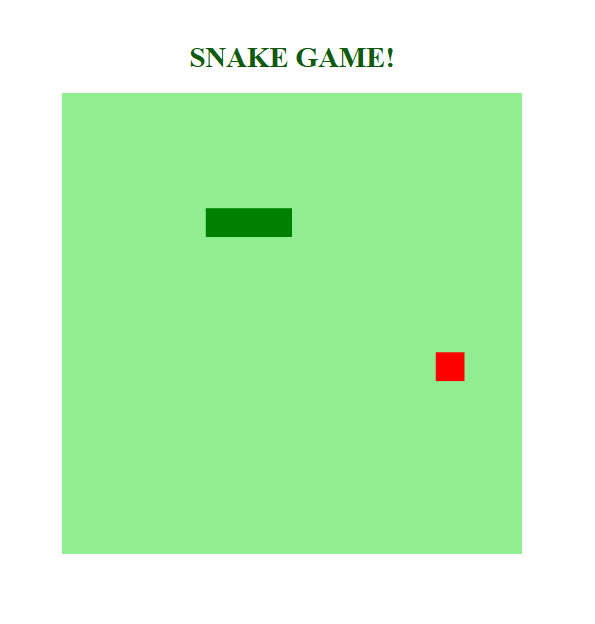

# 🐍 Snake Game
Este projeto é uma recriação do clássico **jogo da cobrinha** usando **HTML5**, **CSS3** e **JavaScript puro**, com foco em lógica de programação, manipulação de elementos com o DOM e interações com o teclado.

 <!-- Substitua por uma imagem/print do seu jogo -->

---

## 🎮 Como Jogar

- Use as **setas do teclado** (↑ ↓ ← →) para controlar a direção da cobrinha.
- Coma os quadradinhos (comida) para crescer e ganhar pontos.
- Evite colidir com o próprio corpo.
- Quanto mais você cresce, mais rápido o jogo fica!

**Link para jogar:** [https://mariana-nogueira21.github.io/jogo-dio/](https://mariana-nogueira21.github.io/jogo-dio/)

---

## 🧠 Tecnologias Utilizadas

- HTML5: estrutura básica da página e canvas para o jogo
- CSS3: estilização do layout e centralização da área de jogo
- JavaScript: lógica do jogo, controle de movimento, colisões e pontuação

---

## 🚀 Como Executar Localmente

1. Clone o repositório:
   ```bash
   git clone https://github.com/mariana-nogueira21/jogo-dio.git
